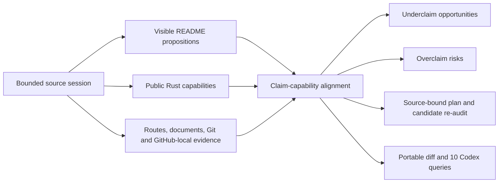

# RepoSeiri

[日本語](#日本語) · [英語](#english)

## 日本語

[](https://github.com/ViszCham/RepoSeiri/actions/workflows/ci.yml)

**README が主張することを、リポジトリが示せる証拠の強さに合わせる。**

RepoSeiri は、README の可視本文、公開 Rust surface、文書 route、Git/GitHub-local 構造を一つの bounded source session でモデル化する、Rust 製の repository documentation semantic auditor です。実装されているのに伝わっていない能力と、観測できた根拠より強い主張を同じ evidence model で分け、CLI、versioned machine contract、Codex plugin から review data として提示します。

review判断はsource-session digest、typed evidence reference、coverage stateへ束縛され、観測済み・未観測・解析不能を同じ状態へまとめません。

単に必須ファイルを数えたり、Markdown style を検査したり、README の文章を生成したりするツールではありません。「README が何を主張しているか」と「この source session でリポジトリが何を根拠付きで示せるか」を命題単位で照合します。

- **過小主張を見つける:** 公開 API、実装能力、文書 route があるのに README の価値説明へ現れていない箇所を review candidate にします。
- **過剰主張を抑える:** claim ごとの evidence ceiling を越える表現を typed risk として分離します。
- **不明を誤って否定しない:** macro、未対応構文、budget 超過、読取不能は `Missing` へ潰さず、局所的な `Unknown` として保持します。
- **候補そのものを再監査する:** source digest、UTF-8境界、意味 drift、scope escape、Unknown 増加、ceiling 超過を再確認し、危険な候補を hold します。
- **変更前後を意味で比べる:** source body を portable snapshot に含めず、repository state の semantic diff を作ります。
- **同じ分析を安全に統合する:** canonical Rust analysis を10種類の `seiri.codex.v2` queryへ投影し、query出力とmutation権限を分離します。

**標準監査は安全側です。** repository-local な bounded readだけを使い、ファイルを書かず、network、Git、GitHub operation、policy inventionを開始しません。

### RepoSeiri が答える6つの問い

| 問い | 返す review data |
| --- | --- |
| 実装しているのに README へ出ていない能力は何か | evidence-backed underclaim opportunity |
| README が根拠より強く言っている箇所はどこか | claim-specific ceiling と overclaim risk |
| 解析できなかった箇所をどう扱うか | reason付きの `Unknown` / partial coverage |
| 何を安全にレビュー候補へできるか | source-bound dry-run plan と `Safe` / `Guarded` / `Manual` gate |
| 候補READMEが意味を壊していないか | stale、semantic drift、scope escape、Unknown growthのtyped hold |
| refactorやreleaseで何が変わったか | source bodyを持ち出さないportable semantic diff |

### 仕組みを60秒で理解する



1. Markdownの可視本文を、source spanに束縛されたsubject・action・object・qualifier・condition・polarityへ分解します。
2. Rustの公開logical item、input/output、`cfg`、re-exportをboundedに読み、観測可能なcapability候補へ投影します。buildやruntime成功は推定しません。
3. claimとcapabilityを命題単位で照合し、claim floor、evidence ceiling、support、underclaim、overclaimを別々に保持します。
4. plannerは本文を持たないprose-freeな候補IRを作り、candidateを再解析してからreviewへ出します。
5. report、diff、Codex queryは同じcanonical analysisから導出されます。

### Quickstart

Rust 1.88以上が必要です。最初の体験はCodex integrationではなく、製品本体の`audit`です。

```powershell
git clone https://github.com/ViszCham/RepoSeiri.git
cd RepoSeiri
cargo run --locked --quiet -p seiri-cli -- audit --path . --scope repository --profile common --format markdown
```

次に、review候補、変更比較、agent integrationへ広げます。

```powershell
# 書き込まないreview plan
cargo run --locked --quiet -p seiri-cli -- plan --path . --scope repository --profile common --format markdown

# 2つのrepository rootをportable semanticsで比較
cargo run --locked --quiet -p seiri-cli -- diff --before ../repo-before --after . --profile common --format markdown

# 同じcanonical analysisのCodex向けsummary
cargo run --locked --quiet -p seiri-cli -- codex --path . --scope repository --profile common --query summary --format markdown
```

### 主要な使い方

| 目的 | コマンド |
| --- | --- |
| repository-local evidenceを読む | `cargo run --locked --quiet -p seiri-cli -- audit --path . --profile common --format markdown` |
| source-bound dry-run planを作る | `cargo run --locked --quiet -p seiri-cli -- plan --path . --profile common --format markdown` |
| before/afterのsemantic deltaを見る | `cargo run --locked --quiet -p seiri-cli -- diff --before <before-root> --after <after-root> --profile common --format markdown` |
| 可視proseのwording riskを調べる | `cargo run --locked --quiet -p seiri-cli -- lint-wording --path . --profile common --format markdown` |
| canonical analysisをCodexへ投影する | `cargo run --locked --quiet -p seiri-cli -- codex --path . --profile common --query summary --format markdown` |
| machine contractとsemantic revisionを読む | `cargo run --locked --quiet -p seiri-cli -- contract --format json` |
| public holdout regressionを読む | `cargo run --locked --quiet -p xtask -- calibration-holdout --format json` |
| completion evidenceを組み立てる | `cargo run --locked --quiet -p xtask -- completion --format json` |

profileは`common`, `library`, `cli`, `infra`, `product`, `runtime`, `docs`, `tutorial`, `ml`, `research`, `template`です。通常はrepository rootで`--scope repository`を使います。

### 中核能力

#### READMEを命題として読む

`seiri-markdown`はcode fence、inline code、HTML comment、raw codeを可視proseから分離し、Markdown装飾をまたぐ文をbyte-accurateなsource spanへ戻します。否定を段落全体へ広げず述語局所で扱い、`ClaimAtom`にsubject、action、object、qualifier、condition、polarityを保持します。

#### 公開program surfaceを能力として読む

`seiri-program-local`はmanifestとRust sourceをboundedに読み、公開logical item、function shape、input/output、`cfg`、re-exportを`RepositoryCapabilityIR`へ投影します。macro、`include!`、invalid UTF-8、budget超過、unsupported regionは局所`Unknown`です。compile成功やruntime結果は、観測していない限り主張へ昇格させません。

#### claimを証拠上限へ合わせる

`ClaimCapabilityMembrane`は、同じ価値dimensionに何かあるだけではsupportにしません。claim atomとcapability semantic signature、provenance、claim-specific ceilingが整合する場合だけsupportを引き上げます。「コードに似たものがある」ことと「READMEで強く断言できる」ことを分離します。

#### 日本語と英語を意味で照合する

日本語sectionと英語sectionを距離だけで対応付けず、意味項、polarity、qualifier、conditionを持つtyped alignmentとして扱います。片方だけに追加された能力、否定の反転、条件の脱落を同じ意味とは扱いません。

#### 提案を再解析してから見せる

plannerは既存targetへのedit、appeal suggestion、claim draftをdry-runで作ります。claim draftはREADME本文を保持しません。candidate re-auditはbase sourceのdigestとbyte長、UTF-8境界、semantic drift、scope escape、Unknown増加、evidence ceilingを再検査し、staleまたは危険な候補をtyped holdにします。

#### portableに比較し、用途別に投影する

`seiri-delta`はsource bodyやhost absolute pathをpublic snapshotのidentityへ入れず、semantic fingerprintを比較します。`seiri-codex`は同じcanonical analysisとplanを、用途別の10 queryへborrowed projectionします。

### なぜRepoSeiriか

| アプローチ | 主に扱うもの | RepoSeiriの境界 |
| --- | --- | --- |
| README checklist | sectionやfileの有無 | route presenceに加えてclaimとevidenceを意味単位で照合する |
| Markdown linter | 文法、style、表現 | wordingだけでなくprogram capabilityとevidence ceilingを扱う |
| 一般的なstatic analysis | code構造 | README claim、docs route、program surfaceを一つのsource sessionへ結ぶ |
| prose generator | 書き換え文章 | 標準plannerはprose-free / dry-runで、candidateを再監査する |
| RepoSeiri | documentation claim integrity | underclaimとoverclaimを同じtyped evidence modelで扱う |

### 状態と安全モデル

- `Verified`はrepository-local targetと構造evidenceが一致したroute stateです。一般的な正しさの証明ではありません。
- `Routed`はREADMEに入口がある状態、`Structured`は構造evidenceがある状態です。片方をもう片方の証拠へ自動昇格しません。
- `Absent`と`Unknown`を分け、未観測を不在と断定しません。
- `Safe`, `Guarded`, `Manual`はreview gateです。planner自身は書き込みません。
- standard auditはlocal、bounded、read-onlyです。remote analysisはopt-inで、typed terminal stateとして別管理します。
- security、license、ownership、support、governanceなどのpolicyを自動生成しません。
- RepoSeiriはrepository-local evidenceを評価します。人気、信頼、安全性、品質、法的適合性、production readinessを保証しません。

### Codex integration

plugin sourceは`plugins/reposeiri`にあります。pluginは意味判断を複製する簡易実装ではなく、canonical Rust coreの上に置くthin integration layerです。launcherはnative runtime、machine contract、semantic revisions、runtime manifest、binaryとschemaのSHA-256を検査し、silent fallbackを行いません。

| Query | 確認する問い |
| --- | --- |
| `summary` | 監査範囲、件数、主要priorityは何か |
| `routes` | READMEの入口とrepository-local targetはどう結び付くか |
| `evidence` | 判断を支えるtyped evidenceとcoverageは何か |
| `documents` | bounded Markdown / GitHub-local解析で何が観測されたか |
| `governance` | facet、content、consistency、scope、freshnessはどうなっているか |
| `patches` | existing-target edit、appeal suggestion、holdは何か |
| `linter` | 可視proseにevidence-scoped wording riskがあるか |
| `actions` | review用typed program / argv suggestionは何か |
| `remote` | opt-in remote analysisのtyped terminal stateは何か |
| `pr-body` | 観測済みevidenceからどんなdraft PR bodyを作れるか |

query outputはfile write、command execution、branch、commit、push、PR、mergeの権限を生成しません。これらのmutationには別の明示権限が必要です。

### Engineering / Verification

RepoSeiriはCIでRepoSeiri自身を監査します。現行workflowは次を分離して実行します。

- pinned Rust toolchainでのformat、workspace test、clippy `-D warnings`、MSRV check
- `cargo audit`によるlocked dependency audit
- RepoSeiri自身への`audit`、`plan`、Codex `summary` / `evidence` / `linter`
- public synthetic holdoutとcoverage / Wilson interval
- Linux / Windows standalone binaryとplugin bundle smoke
- bounded fuzz smokeとsource-bound completion gate

tracked holdoutは各task 4 caseの低N regressionで、最低20 caseを満たさないため`insufficient_sample`です。performance receiptの時間値も観測条件へ束縛された記録であり、一般性能やspeedupの主張ではありません。

### 文書と方針

バグ報告、機能要望、質問は[Issue template / バグ報告・機能要望・質問](.github/ISSUE_TEMPLATE/)から受け付けます。

| 読みたいもの | 入口 |
| --- | --- |
| architecture、claim alignment、self-audit、migration、schema | [Documentation Topology](docs/README.md) |
| CIとself-audit artifact | [CI workflow](.github/workflows/ci.yml) |
| security report | [SECURITY.md](SECURITY.md) |
| support | [SUPPORT.md](SUPPORT.md) |
| Issue受付 | [Issue template / バグ報告・機能要望・質問](.github/ISSUE_TEMPLATE/) |
| contribution | [CONTRIBUTING.md](CONTRIBUTING.md) |
| release / lifecycle | [Release Process](docs/release.md) / [Lifecycle Boundary](docs/lifecycle.md) |
| governance | [GOVERNANCE.md](GOVERNANCE.md) |
| ownership | [CODEOWNERS](.github/CODEOWNERS) |
| license | [LICENSE](LICENSE) |
| repository hygiene | [Repository Hygiene](docs/hygiene.md) |
| change history | [CHANGELOG.md](CHANGELOG.md) |

RepoSeiri 1.1.0は個人で開発・公開しているRust engineering projectです。このrepositoryにある実装とmachine contractを上記の範囲で説明しますが、固定SLA、release cadence、compatibility duration、外部contributionの採用を約束しません。

---

## English

[](https://github.com/ViszCham/RepoSeiri/actions/workflows/ci.yml)

**Keep README claims aligned with the strength of evidence a repository can show.**

RepoSeiri is a repository documentation semantic auditor written in Rust. It models visible README prose, public Rust surfaces, documentation routes, and Git/GitHub-local structure in one bounded source session. It uses the same evidence model to separate capabilities the README fails to communicate from claims stronger than the observed support, then exposes that review data through a CLI, a versioned machine contract, and a Codex plugin.

Review decisions are bound to a source-session digest, typed evidence references, and a coverage state; observed, unobserved, and unanalyzable states are not merged.

It is not merely a required-file checklist, Markdown style checker, or README prose generator. RepoSeiri compares what the README claims with what the repository can support in the current source session, proposition by proposition.

- **Find underclaims:** turn public APIs, implemented capabilities, and documentation routes missing from the value narrative into review candidates.
- **Bound overclaims:** separate wording above a claim-specific evidence ceiling as typed risk.
- **Do not misreport unknown as absent:** retain macros, unsupported syntax, exhausted budgets, and read failures as localized `Unknown`.
- **Re-audit the candidate itself:** hold proposals that fail source-digest, UTF-8-boundary, semantic-drift, scope-escape, Unknown-growth, or ceiling checks.
- **Compare states semantically:** produce portable repository deltas without including source bodies in the portable snapshot.
- **Integrate one analysis safely:** project the canonical Rust analysis into ten `seiri.codex.v2` queries while keeping query output separate from mutation authority.

**Standard audits are safe by default.** They use bounded repository-local reads and do not write files, initiate network, Git, or GitHub operations, or invent policy.

### Six Questions RepoSeiri Answers

| Question | Review data returned |
| --- | --- |
| Which implemented capabilities are missing from the README? | Evidence-backed underclaim opportunities |
| Where is README wording stronger than its support? | Claim-specific ceilings and overclaim risks |
| How are unanalyzed regions represented? | Reason-bearing `Unknown` and partial coverage |
| What can become a safe review candidate? | Source-bound dry-run plans with `Safe` / `Guarded` / `Manual` gates |
| Does a candidate preserve meaning? | Typed holds for stale source, semantic drift, scope escape, and Unknown growth |
| What changed across a refactor or release? | Portable semantic diffs without source bodies |

### Understand The System In 60 Seconds


1. Decompose visible Markdown prose into source-bound subjects, actions, objects, qualifiers, conditions, and polarity.
2. Read public Rust logical items, inputs and outputs, `cfg`, and re-exports under bounds, then project observable capability candidates. Do not infer build or runtime success.
3. Align claims with capabilities proposition by proposition while keeping claim floors, evidence ceilings, support, underclaims, and overclaims separate.
4. Build prose-free candidate IR and reparse each candidate before exposing it for review.
5. Derive reports, diffs, and Codex queries from the same canonical analysis.

### Quickstart

Rust 1.88 or newer is required. Start with the product's `audit`, not its Codex integration.

```powershell
git clone https://github.com/ViszCham/RepoSeiri.git
cd RepoSeiri
cargo run --locked --quiet -p seiri-cli -- audit --path . --scope repository --profile common --format markdown
```

Then expand into review candidates, state comparison, and agent integration.

```powershell
# Review plan; writes nothing
cargo run --locked --quiet -p seiri-cli -- plan --path . --scope repository --profile common --format markdown

# Compare two repository roots through portable semantics
cargo run --locked --quiet -p seiri-cli -- diff --before ../repo-before --after . --profile common --format markdown

# Codex summary over the same canonical analysis
cargo run --locked --quiet -p seiri-cli -- codex --path . --scope repository --profile common --query summary --format markdown
```

### Main Uses

| Goal | Command |
| --- | --- |
| Read repository-local evidence | `cargo run --locked --quiet -p seiri-cli -- audit --path . --profile common --format markdown` |
| Produce a source-bound dry-run plan | `cargo run --locked --quiet -p seiri-cli -- plan --path . --profile common --format markdown` |
| Compare before/after semantic state | `cargo run --locked --quiet -p seiri-cli -- diff --before <before-root> --after <after-root> --profile common --format markdown` |
| Inspect wording risk in visible prose | `cargo run --locked --quiet -p seiri-cli -- lint-wording --path . --profile common --format markdown` |
| Project canonical analysis into Codex | `cargo run --locked --quiet -p seiri-cli -- codex --path . --profile common --query summary --format markdown` |
| Read the machine contract and semantic revisions | `cargo run --locked --quiet -p seiri-cli -- contract --format json` |
| Read the public holdout regression | `cargo run --locked --quiet -p xtask -- calibration-holdout --format json` |
| Assemble completion evidence | `cargo run --locked --quiet -p xtask -- completion --format json` |

Profiles are `common`, `library`, `cli`, `infra`, `product`, `runtime`, `docs`, `tutorial`, `ml`, `research`, and `template`. Use `--scope repository` at the repository root for the usual case.

### Core Capabilities

#### Read A README As Propositions

`seiri-markdown` separates code fences, inline code, HTML comments, and raw code from visible prose, then rebinds text crossing Markdown decorations to byte-accurate source spans. Negation stays predicate-local instead of leaking across a paragraph. `ClaimAtom` retains subject, action, object, qualifier, condition, and polarity.

#### Read Public Program Surfaces As Capabilities

`seiri-program-local` reads manifests and Rust sources under explicit bounds, then projects public logical items, function shapes, inputs and outputs, `cfg`, and re-exports into `RepositoryCapabilityIR`. Macros, `include!`, invalid UTF-8, exhausted budgets, and unsupported regions remain localized `Unknown`. Compile success and runtime outcomes are not promoted unless observed.

#### Keep Claims Below Their Evidence Ceiling

`ClaimCapabilityMembrane` does not infer support from co-presence in the same value dimension. Support rises only when a claim atom aligns with a capability semantic signature and the provenance and claim-specific ceiling admit the mode. “Similar code exists” remains distinct from “the README can state this strongly.”

#### Align Japanese And English By Meaning

Japanese and English sections are aligned through typed semantic terms, polarity, qualifiers, and conditions rather than distance alone. A capability added to one language only, reversed negation, or a dropped condition is not silently treated as equivalent.

#### Reparse A Proposal Before Showing It

The planner produces existing-target edits, appeal suggestions, and claim drafts as dry runs. Claim drafts retain no README prose. Candidate re-audit checks the base digest and byte length, UTF-8 boundaries, semantic drift, scope escape, Unknown growth, and evidence ceiling, then records stale or unsafe candidates as typed holds.

#### Compare Portably And Project By Purpose

`seiri-delta` compares semantic fingerprints without using source bodies or host absolute paths as public-snapshot identity. `seiri-codex` renders borrowed projections of the same canonical analysis and plan through ten purpose-specific queries.

### Why RepoSeiri?

| Approach | Primary concern | RepoSeiri boundary |
| --- | --- | --- |
| README checklist | Presence of files and sections | Adds proposition-level alignment between claims and evidence |
| Markdown linter | Grammar, style, and wording | Adds program capability and claim-specific evidence ceilings |
| General static analysis | Code structure | Connects README claims, documentation routes, and program surfaces in one source session |
| Prose generator | Rewritten text | Keeps the standard planner prose-free and dry-run, then re-audits candidates |
| RepoSeiri | Documentation claim integrity | Treats underclaims and overclaims through the same typed evidence model |

### States And Safety Model

- `Verified` is a route state where a repository-local target agrees with structural evidence. It is not proof of general correctness.
- `Routed` means that the README has an entry point; `Structured` means structural evidence exists. Neither is automatically promoted into the other.
- `Absent` remains distinct from `Unknown`; unobserved is not reported as nonexistent.
- `Safe`, `Guarded`, and `Manual` are review gates. The planner itself does not write.
- Standard audit is local, bounded, and read-only. Remote analysis is opt-in and retained as a separate typed terminal state.
- Security, license, ownership, support, and governance policy is not generated automatically.
- RepoSeiri evaluates repository-local evidence. It does not guarantee popularity, trust, safety, quality, legal fitness, or production readiness.

### Codex Integration

Plugin source lives in `plugins/reposeiri`. The plugin is not a second, simplified implementation of the semantic decisions; it is a thin integration layer over the canonical Rust core. The launcher validates the native runtime, machine contract, semantic revisions, runtime manifest, and binary and schema SHA-256 values, with no silent fallback.

| Query | Question answered |
| --- | --- |
| `summary` | What was covered, how large is the result, and what priority is visible? |
| `routes` | How do README entry points connect to repository-local targets? |
| `evidence` | Which typed evidence and coverage support each decision? |
| `documents` | What did bounded Markdown and GitHub-local analysis observe? |
| `governance` | What are the facet, content, consistency, scope, and freshness states? |
| `patches` | Which existing-target edits, appeal suggestions, and holds exist? |
| `linter` | Does visible prose contain evidence-scoped wording risk? |
| `actions` | Which typed program or argv suggestions are available for review? |
| `remote` | What is the typed terminal state of opt-in remote analysis? |
| `pr-body` | Which draft PR body can be assembled from observed evidence? |

Query output does not create authority to write files, execute commands, create branches, commit, push, open PRs, or merge. Those mutations require separate explicit authority.

### Engineering / Verification

RepoSeiri runs RepoSeiri against itself in CI. The current workflow separates:

- formatting, workspace tests, clippy `-D warnings`, and MSRV checks on pinned Rust toolchains;
- locked dependency auditing with `cargo audit`;
- RepoSeiri `audit`, `plan`, and Codex `summary`, `evidence`, and `linter` over RepoSeiri itself;
- public synthetic holdout reporting with coverage and Wilson intervals;
- standalone binary and plugin-bundle smoke tests on Linux and Windows; and
- bounded fuzz smoke and a source-bound completion gate.

The tracked holdout is a low-N regression corpus with four cases per task, below the minimum of 20, so it remains `insufficient_sample`. Elapsed values in performance receipts are also observations bound to explicit conditions, not general-performance or speedup claims.

### Documentation And Policy

Use the [issue template for bug report, feature request, and question](.github/ISSUE_TEMPLATE/) for project intake.

| Topic | Entry point |
| --- | --- |
| Architecture, claim alignment, self-audit, migrations, and schemas | [Documentation Topology](docs/README.md) |
| CI and self-audit artifacts | [CI workflow](.github/workflows/ci.yml) |
| Security reporting | [SECURITY.md](SECURITY.md) |
| Support | [SUPPORT.md](SUPPORT.md) |
| Issue intake | [Issue template for bug report, feature request, and question](.github/ISSUE_TEMPLATE/) |
| Contributions | [CONTRIBUTING.md](CONTRIBUTING.md) |
| Release and lifecycle | [Release Process](docs/release.md) / [Lifecycle Boundary](docs/lifecycle.md) |
| Governance | [GOVERNANCE.md](GOVERNANCE.md) |
| Ownership | [CODEOWNERS](.github/CODEOWNERS) |
| License | [LICENSE](LICENSE) |
| Repository hygiene | [Repository Hygiene](docs/hygiene.md) |
| Change history | [CHANGELOG.md](CHANGELOG.md) |

RepoSeiri 1.1.0 is a personally developed and published Rust engineering project. It describes the implementation and machine contracts present in this repository within the boundaries above, but does not promise a fixed SLA, release cadence, compatibility duration, or acceptance of external contributions.
